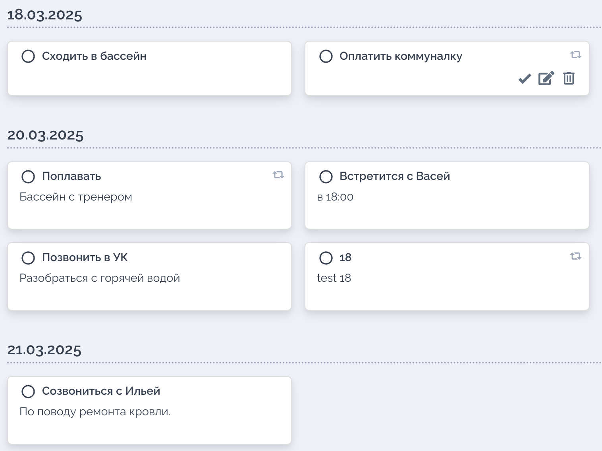
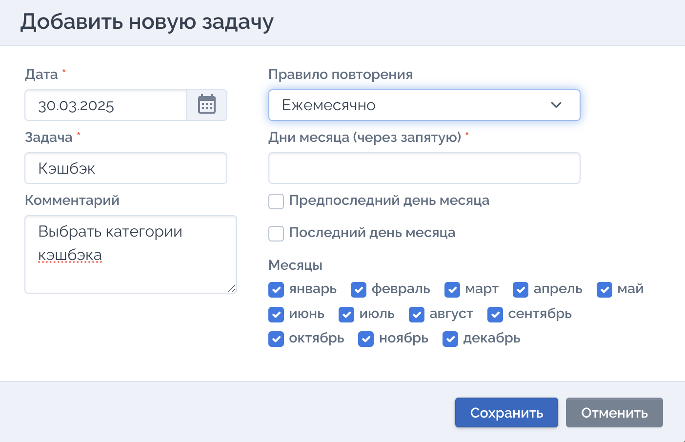

1. #### Описание проекта
	Go веб-сервер реализует функциональность планировщика задач, аналог TO-DO-листа.
    Планировщик хранит задачи, каждая из них содержит дату дедлайна, заголовок, комментарий и правило повторения. 
    Задачи могут повторяться по заданному правилу: ежегодно, через установленное количество дней, в определённые дни недели или месяца.
    Если отметить задачу с повторением как выполненную, она переносится на следующую дату в соответствии с определенным для нее правилом. Обычные задачи при выполнении будут удаляться.

2. ### Структура проекта
- `go_final_project`
    - `config`
        * `getEnvVar.go` функции управления переменными окружения
    - `handlers` обработчики http запросов
        * `get_tasks.go` возвращает список задач
        * `post_add_task.go` добавляет новую задачу
        * `delete_task.go` удаляет задачу
        * `put_edit_task.go` редактирует задачу
        * `post_done_task.go` отмечает задачу как выполненную
        * `get_next_date.go` вычисляет следующую дату выполнения задачи
        * `post_signin.go` аутентификация пользователя (JWT)
        * `start_file_server.go` обслуживает статические файлы (HTML, CSS, JS)
    - `models` структуры и методы для работы с задачами
        * `tasks.go` определена основная структура задач и метод верификации данных
    - `service` содержит вспомогательные функции
        * `generateJWT.go` генерация JWT-токена
        * `verify_token.go` проверка JWT-токена
        * `nextdate.go` вычисление следующей даты повторения задача
        * `response.go` формирование JSON-ответов
    - `tests` тесты для обработчиков и сервисов
    - `web` фронтенд-часть приложения
    - `.env` файл переменных окружения
    - `dockerfile` файл создания docker образа
    - `main.go` реализован веб-сервер использованием REST API. Сервер поддерживает операции CRUD, а также аутентификацию пользователей. Использована данных SQLite, маршрутизация и обработка запросов выполняются с помощью библиотеки chi
    - `scheduler.db` файл базы данных

4. ### Переменные окружения в файле .env
    - TODO_PORT=7540
    - WEB_DIR="./web"
    - TODO_DBFILE="scheduler.db"
    - TODO_PASSWORD="12345"
    - TODO_SCRTKEY="mysecretkey"

3. ### API реализует следующие операции
    - добавить задачу
    - получить список задач
    - удалить задачу
    - получить параметры задачи
    - изменить параметры задачи
    - отметить задачу как выполненную

4. ### В процессе разработки реализовано
    - определены переменные окружения в файле .env    
    - HTTP-сервис на базе маршрутизатора chi 
    - файл-сервер, при запросе http://localhost:7540/ возвращает index.html из директории web
    - база данных в файле scheduler.db с таблицей scheduler
    - алгоритм повторение задач:
        * по дням, формат d n (где d ключ типа повторения задачи, n число дней в диапазоне 1 до 400). Пример: d 1; d 7; d 60 
        * ежегодно, формат y
        * по дням недели, формат w n (где w ключ типа повторения задачи, n дни недели через запятую от 1 до 7). Пример: w 7; w 1,4,5; w 2,3 
    - взаимодействие с базой данных
        * добавление новой задачи
        * корректировка даты повторения задачи
        * получение отсортированного списка ближайших 
        * поиск задачи по содержанию и дате
        * получение параметров задачи по id
        * корректировка параметров задачи
    - работа с задачами:
        * создание, корректировка, удаление задач
        * автоматическое удаление одноразовых задач при нажатии кнопки выполнено
        * перенос повторяющихся задача на новую дату при нажатии кнопки выполнено
    - обработка JSON. 

5. ### Запуск
    Команда для запуска приложения `go run main.go`. Для просмотра в браузере ввести URL: `http://localhost:7540/`

6. ### Тесты
	Tесты следует запускать со значением `false` в параметре `FullNextDate`: `var FullNextDate = false`
	
    Команды для запуска тестов:
    - общий тест `go test ./tests`
    - веб-сервера `go test -run ^TestApp$ ./tests`
    - базы данных `go test -run ^TestDB$ ./tests`
    - правил вопторения задач `go test -run ^TestNextDate$ ./tests`
    - добавление задачи `go test -run ^TestAddTask$ ./tests`
    - фомирование списка ближайших задач `go test -run ^TestTasks$ ./tests`
    - поиск задачи `go test -run ^TestTasks$ ./tests`
    - получение текущих параметров задачи `go test -run ^TestTask$ ./tests`
    - обновление (редактирование) параметров задачи `go test -run ^TestEditTask$ ./tests`
    - задача выполнена `go test -run ^TestDone$ ./tests`
    - удаление задачи `go test -run ^TestDelTask$ ./tests`
		
7. ### Docker
    Сборка Docker образа и его запуск
	- сборка Docker образа `docker build --tag todo_app:v1.0 .`
	- запуск Docker образа  `docker run -d -p 8080:7540 todo_app:v1.0`

      
    